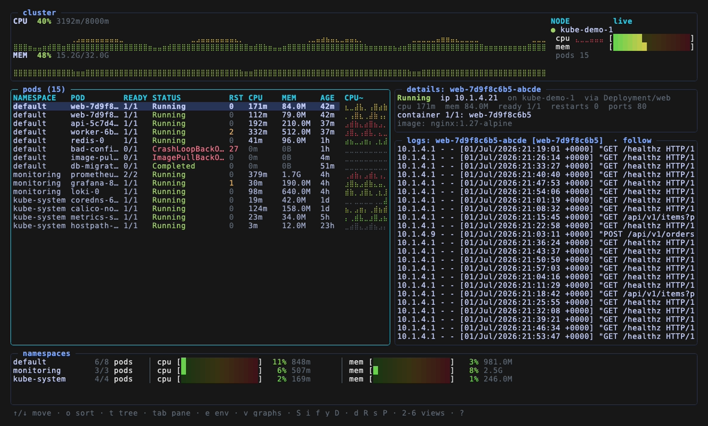
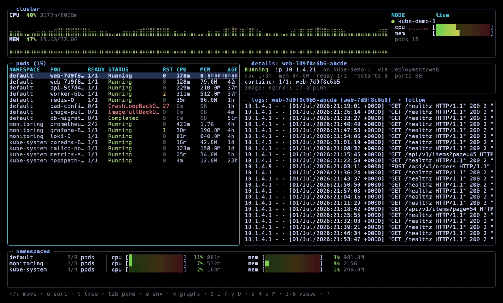

# tankertop

A btop-style terminal dashboard for **Kubernetes and Docker** — truecolor braille
graphs, live logs, an environment/secrets pane, a container filesystem browser,
and full container management, in one static binary with no runtime dependencies.





Two things set it apart from other cluster/container TUIs:

- **Monitor a remote cluster over SSH with nothing installed on it.**
  `tankertop --ssh user@node` reads the kubeconfig over SSH and tunnels to the API
  server — only port 22 needs to be reachable, the API port can stay firewalled,
  and no agent, binary, or RBAC is ever deployed on the node. Auth is whatever
  `ssh` already does (agent keys, `~/.ssh/config`, bastions, 2FA).
- **Try it with no cluster at all.** `--demo` renders a full synthetic cluster —
  the screenshot and GIF above are `--demo` — so you can see everything before
  pointing it at anything real:

  ```sh
  curl -fsSL https://raw.githubusercontent.com/tankertop/tankertop/main/install.sh | bash
  tankertop --demo
  ```

It drives **any Kubernetes cluster** — k3s, kind, EKS, GKE, AKS, OpenShift,
microk8s — through your kubeconfig, and **any container host** (Docker, Podman,
nerdctl) with `--docker`. It is a single self-contained binary: no daemon, no
sidecar, no dependencies.

## Install

tankertop is a single static binary (no runtime deps). Pick one:

**Installer** (Linux/macOS; verifies the download against the published checksums):

```sh
curl -fsSL https://raw.githubusercontent.com/tankertop/tankertop/main/install.sh | bash
# or a specific version:  ... | bash -s -- v0.1.1
```

**Homebrew** (macOS/Linux):

```sh
brew install tankertop/tap/tankertop
```

**Container image** (GHCR and Docker Hub, multi-arch) — great for a quick look
with no local install; mount a kubeconfig to use a real cluster:

```sh
docker run --rm -it ghcr.io/tankertop/tankertop --demo
docker run --rm -it -v "$HOME/.kube:/root/.kube:ro" ghcr.io/tankertop/tankertop
# Docker Hub mirror: tankertop/tankertop
```

**Debian/Ubuntu (`.deb`)** — tracked by `dpkg`, so `apt remove tankertop` cleans up
(an `.rpm` with the same name scheme is published for Fedora/RHEL):

```sh
arch=$(dpkg --print-architecture)                     # amd64 or arm64
tag=$(curl -fsSL https://api.github.com/repos/tankertop/tankertop/releases/latest \
      | grep -m1 '"tag_name"' | cut -d'"' -f4)
deb="tankertop_${tag#v}_linux_${arch}.deb"
curl -fsSLO "https://github.com/tankertop/tankertop/releases/download/${tag}/${deb}"
sudo apt install "./${deb}"
```

**With Go** (≥ the version in `go.mod`):

```sh
go install github.com/tankertop/tankertop@latest
```

**From source:**

```sh
git clone https://github.com/tankertop/tankertop && cd tankertop
make build          # ./tankertop for this host
make dist           # cross-compiled binaries in dist/ (linux/darwin × amd64/arm64)
```

Every release publishes a `checksums.txt`; the installer verifies against it
automatically, and you can check any downloaded asset yourself with
`sha256sum -c` (or `shasum -a 256`).

### Prerequisites

A reachable kubeconfig (or an in-cluster service account) — any distribution
works. `metrics-server` (or equivalent) powers the CPU/MEM meters; without it the
app still runs and shows `0`. For example, on a microk8s node:

```sh
microk8s config > ~/.kube/config
microk8s enable metrics-server
```

## Monitor a remote cluster over SSH

```sh
tankertop --ssh <user>@<ip>
```

Nothing is installed on the node. tankertop reads its kubeconfig over SSH, opens
an `ssh -L` tunnel to the API server, and points client-go at it — so only port
22 has to be reachable and the API server port can stay firewalled.

**Credentials are OpenSSH's business, not tankertop's.** There is no password
flag, and nothing is stored: authentication is whatever `ssh <host>` already does
on your machine — agent keys, `~/.ssh/config` aliases, `ProxyJump` bastions,
`known_hosts` checking, passphrase and 2FA prompts. The tunnel is established
before the TUI takes the screen, so those prompts work normally.

```sh
tankertop --ssh mynode                       # a ~/.ssh/config alias
tankertop --ssh user@node --ssh-opt -J --ssh-opt bastion.corp     # via a bastion
tankertop --ssh user@node --ssh-opt -i --ssh-opt ~/.ssh/k8s_ed25519
tankertop --ssh user@node --ssh-kubeconfig-cmd 'sudo cat /etc/rancher/k3s/k3s.yaml'
```

By default tankertop runs `microk8s config`, falling back to `kubectl config view
--raw` and then `~/.kube/config`; `--ssh-kubeconfig-cmd` overrides that.

Requires the `ssh` client in `PATH`. Two things still run *on the node* because
they shell out to `microk8s kubectl`: the interactive shell (`S`) opens its own
SSH session, and a port-forward (`P`) binds `0.0.0.0` **on the node**, not on
your machine. Everything else — pods, metrics, logs, env, YAML, events, delete,
restart, scale — goes through the tunnel.

## Monitor Docker instead of Kubernetes

```sh
tankertop --docker                          # local engine
tankertop --docker --ssh user@host          # a remote engine, over ssh (no tunnel)
tankertop --docker --docker-bin podman      # or nerdctl
```

tankertop maps a container host onto the same dashboard: a **container** is a pod,
its **Compose project** is the namespace, its **Compose service** is the workload
— so the tree (`t`) groups `project ▸ service ▸ container`, and logs (`docker
logs`), the shell (`S`), inspect (`i`), the env pane (`docker inspect` +
`docker exec env`), live CPU/MEM (`docker stats`) and remove (`d`) all work as
they do for Kubernetes. Memory/CPU limits set with `--memory`/`--cpus` show up in
the pressure view (`4`); the nodes view (`5`) is the single engine host. The
detail pane adds the network rate and PID count, which the Kubernetes metrics API
doesn't expose.

Full container lifecycle, since Docker has one (Kubernetes does not): `u` start,
`x` stop, `c` pause/unpause, `R` restart, `K` kill (confirmed), `d` remove
(confirmed). `f` browses the container's filesystem. The network view (`2`) lists
docker networks and the containers on each, plus a copy-paste Mermaid diagram of
the topology; the nodes view (`5`) adds a swap meter and load average from the
host's `/proc`.

It shells out to the `docker` CLI (so Podman and nerdctl work via `--docker-bin`);
with `--ssh` it runs those commands on the remote host over the ssh session, so
nothing is installed there and no daemon socket needs exposing.

Concepts Docker doesn't have are handled honestly: scaling (`s`) and port-forward
(`P`) explain they don't apply (containers publish ports directly), and the events
view (`3`), built from Kubernetes control-plane events, stays empty.

## Deploy on a server

tankertop is an interactive TUI, so you run it on a machine and view it in a
terminal — it is not a background daemon. Three setups:

- **From your workstation over SSH:** `tankertop --ssh user@node` (above). Nothing
  to install on the node.
- **On the cluster node:** install the binary (above) and run it over SSH.
  It uses the node's `~/.kube/config`. This is the simplest option, and the one
  where `S` and `P` behave most naturally.
- **With an exported kubeconfig:** `scp node:~/.kube/config ./kc && tankertop
  --kubeconfig ./kc` (edit the `server:` field to the node's reachable IP). Needs
  the API server port open to you.

Before a release exists (or to run an unreleased commit), build on the node and
install it yourself — stamping the version keeps `tankertop -version` honest about
which commit is running:

```sh
rsync -a --exclude .git ./ node:~/tankertop/
ssh node 'cd ~/tankertop && go build -trimpath \
  -ldflags "-s -w -X main.version=$(git rev-parse --short HEAD)" -o tankertop . \
  && sudo install -m 0755 tankertop /usr/local/bin/tankertop'
```

Note this copies the binary rather than linking it, so a later rebuild in the
source tree does not update `/usr/local/bin` — re-run the install.

Or cross-compile for the server's arch and copy it over:

```sh
make dist && scp dist/tankertop-linux-arm64 user@server:/usr/local/bin/tankertop
```

Releases (tarballs, `.deb`/`.rpm`, checksums) are produced automatically by
GitHub Actions when you push a `vX.Y.Z` tag (`git tag v0.1.0 && git push --tags`).

## Run

```sh
./tankertop                   # interactive btop-style TUI (all namespaces)
./tankertop --demo            # synthetic cluster, no kubeconfig needed
./tankertop --theme gruvbox   # tokyonight|gruvbox|nord|dracula|mono
./tankertop --namespace demo  # single namespace
./tankertop --interval 1s     # refresh rate
./tankertop --snapshot        # print one plain-text frame and exit (scriptable)
./tankertop --dump-frame 140x40                    # render one TUI frame to stdout (for testing)
./tankertop --dump-frame 140x40 --frame-mode net   # modes: list|net|logs|help|modal
```

### Keys

**Global**

| key | action |
|-----|--------|
| `1`…`6` | dashboard / network / events / pressure / nodes / port-forwards |
| `T` | cycle colour theme (saved) |
| `?` | help + plain-language explanations of k8s concepts |
| `r` | refresh now |
| `tab` | switch focus between the pods list and the bottom-right pane |
| `e` | switch that pane between **logs** and the container's **environment** |
| `q` | quit (saves preferences) |

**Pods list (focused)**

| key | action |
|-----|--------|
| `↑`/`↓` `PgUp`/`PgDn` `g`/`G` | move selection |
| `o` | cycle sort: name → cpu → mem → restarts → age → status |
| `t` | toggle tree view: namespace ▸ workload ▸ pod |
| `space` | fold/unfold the node under the cursor (tree view) |
| `n` | fold/unfold the namespace (tree view) |
| `N` | fold/unfold every namespace — the whole cluster on one screen (tree view) |
| `/` | filter by namespace/pod name |
| `S` | open an interactive shell inside the selected container (`exec -it`) |
| `i` | inspect: env, mounts, `df`, processes, `ls /` (read-only) |
| `f` | browse the container filesystem (enter opens dirs/files, backspace up) |
| `y` | view live YAML |
| `D` | describe + recent events |
| `d` | delete pod (confirm) |
| `R` | restart workload — rollout restart for Deployments (confirm) |
| `s` | scale the Deployment behind the pod |
| `P` | port-forward the pod to this host |

**Logs pane (focused via `tab`)**

| key | action |
|-----|--------|
| `↑`/`↓` `PgUp`/`PgDn` `g`/`G` | scroll |
| `f` | toggle follow-tail |
| `w` | toggle line wrap |
| `p` | toggle previous-container logs (why a `CrashLoopBackOff` died) |
| `[` / `]` | switch container in a multi-container pod |
| `/` | search within the log |

**Env pane (`e` swaps it in for the logs)**

Shows the container's environment twice: what the pod spec *declares* — naming
indirect sources, so `DATABASE_URL ← secret db-creds/url` rather than a value —
and what the process actually *sees*, read with `env` inside the container. The
runtime list therefore also contains what the kubelet injected (the
`KUBERNETES_*` and `*_SERVICE_HOST` service links) and what the image's own
Dockerfile set. It needs a shell in the image; on distroless it falls back to
the declared list. Values with credential-looking names are masked.

| key | action |
|-----|--------|
| `↑`/`↓` `PgUp`/`PgDn` `g`/`G` | scroll |
| `m` | mask / reveal credential-looking values |
| `R` | re-read the runtime env (it is not refreshed on every tick) |
| `[` / `]` | switch container in a multi-container pod |

Destructive/outward actions (`d`, `R`, `s`, `P`) always ask for confirmation first.
The interactive shell and port-forward use the node's `microk8s kubectl`. `P` starts a
**background** port-forward (binds `0.0.0.0` on the host); manage them in the `6` view
(`x` stop selected, `X` stop all).

**Tree view** (`t`) nests pods under the workload that owns them and the
namespace that scopes them, with running totals on every node. `↑`/`↓` walk every
row, headers included, and `space` folds or unfolds whichever node the cursor is
on — a folded node keeps the selection, so the same key reopens it. `n` folds a
namespace, `N` folds them all, turning a 250-pod cluster into a one-screen
summary. Sorting applies at each level, so `o` (cpu) puts the busiest namespace
on top, then its busiest workload. Pod actions (`S i y D d R s P`) need a pod
row; on a header they refuse rather than act on some arbitrary pod beneath it.

**Views:** `5` shows per-node capacity/allocatable/requests/usage with pressure
conditions and pod-slot saturation; `4` ranks pods by memory headroom and flags
unbounded/under-requested/near-OOM pods.

**Preferences** (theme, sort, tree, namespace, interval) are saved on quit to
`$XDG_CONFIG_HOME/tankertop/config.json` and restored next launch; explicit flags override them.

## Flags

Flags accept either a single or double dash (`--theme` and `-theme` both work);
they are documented with `--` for consistency.

| flag | default | meaning |
|------|---------|---------|
| `--kubeconfig` | `$KUBECONFIG` or `~/.kube/config` | kubeconfig path |
| `--ssh` | off | monitor `[user@]host` over an SSH tunnel; installs nothing there |
| `--ssh-opt` | — | extra argument passed to `ssh` (repeatable), e.g. `-J bastion` |
| `--ssh-kubeconfig-cmd` | `microk8s config` … | command run on the SSH host to print a kubeconfig |
| `--docker` | off | monitor a container engine instead of Kubernetes |
| `--docker-bin` | `docker` | container CLI for `--docker`: `docker`/`podman`/`nerdctl` |
| `--kubectl` | auto | kubectl invocation for shell/port-forward (auto-detects `kubectl` or `microk8s kubectl`) |
| `--namespace` | all | limit to one namespace |
| `--interval` | `2s` | refresh interval |
| `--truecolor` | `true` | force 24-bit colour (btop-style gradients) |
| `--theme` | `tokyonight` | colour theme: `tokyonight`/`gruvbox`/`nord`/`dracula`/`mono` |
| `--snapshot` | off | print one frame and exit |

## Roadmap

- **Docker Swarm** — `docker service`/`node`/`stack`, so the nodes and scale views
  come alive for Swarm. This would make tankertop the one TUI covering Kubernetes,
  plain Docker/Podman, *and* Swarm.
- **Process/port/file explorer** — a per-container view of running processes,
  listening ports (by process), and open files, read straight from `/proc`.

## Notes

- Without `metrics-server`, the app still runs; CPU/MEM columns show `0` and the
  header shows `[metrics-server off]`.
- Status column mirrors `kubectl get pods` (CrashLoopBackOff, Init:0/1,
  ContainerCreating, Completed, Error, Terminating, …) and is colour-coded.
- The shell (`S`), inspect (`i`) and the env pane's runtime list all need
  `pods/exec` on the kubeconfig's identity. Masking secret-looking values is
  shoulder-surfing protection, not access control — anyone who can run tankertop
  against the cluster can already read them.
